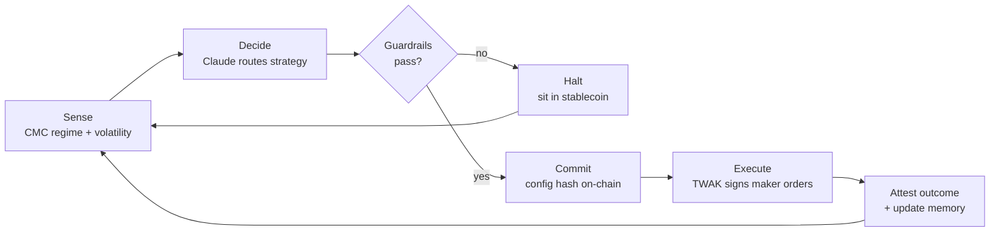
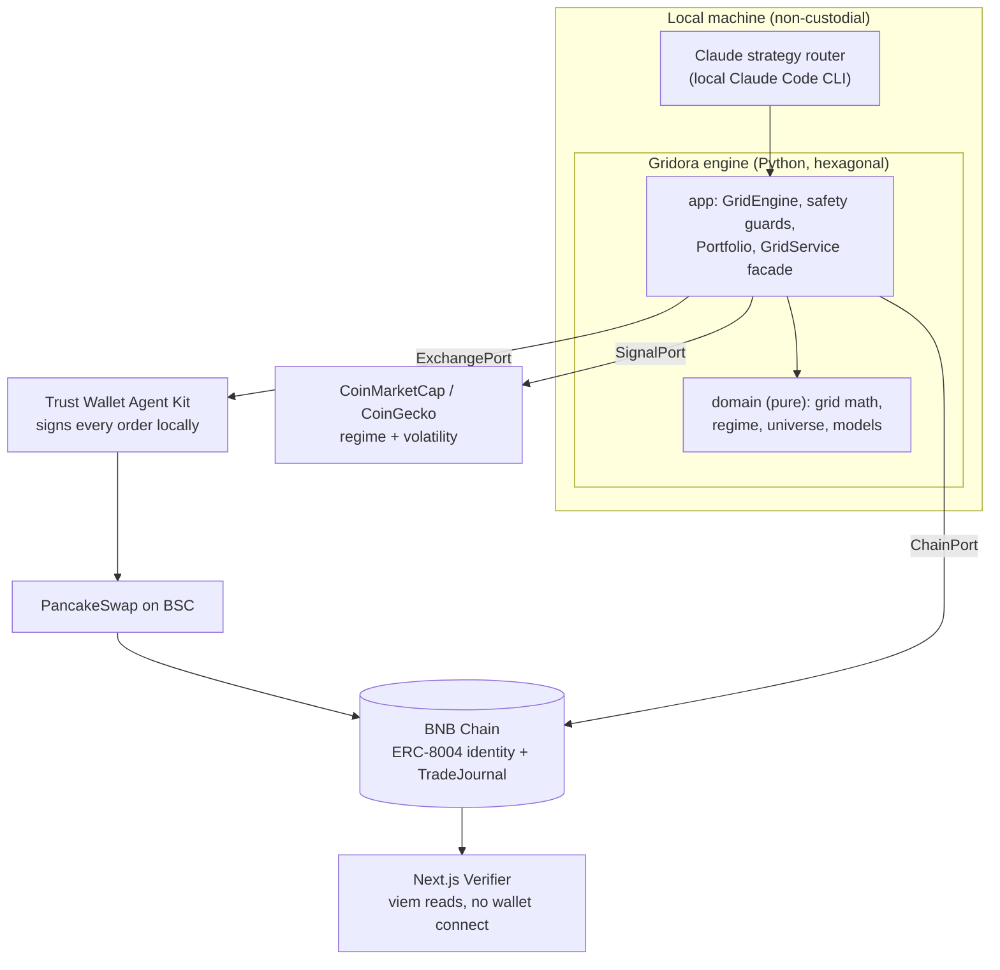
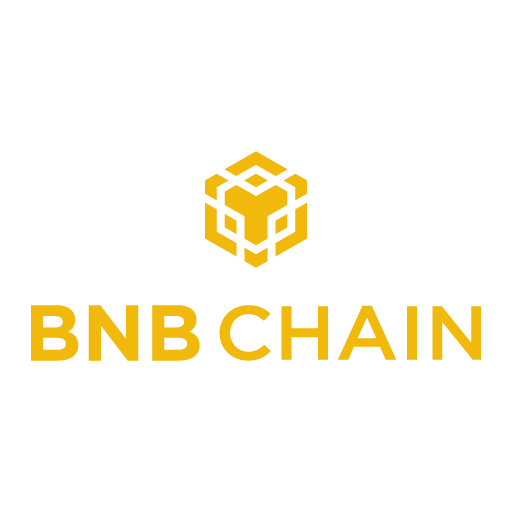

<p align="center">
  
</p>

<h1 align="center">Gridora</h1>

<p align="center">
  <b>A verifiable, non-custodial adaptive-grid trading agent on BNB Chain.</b><br>
  It buys dips and sells rips inside a volatility-sized band, signs every order locally through the
  Trust Wallet Agent Kit, and proves what it did on-chain.
</p>

<p align="center">
  <a href="#strategy">Strategy</a> ·
  <a href="#how-it-works">How it works</a> ·
  <a href="#architecture">Architecture</a> ·
  <a href="#quickstart">Quickstart</a> ·
  <a href="./Gridora-Plan.md">Full plan</a>
</p>

<p align="center">
  <sub>BNB Hack: AI Trading Agent Edition · CoinMarketCap × Trust Wallet × BNB Chain</sub>
</p>

---

## What Gridora is

Gridora runs an adaptive maker-style grid on BNB Smart Chain. It is built on three principles:

1. **Non-custodial.** Keys never leave the Trust Wallet Agent Kit (TWAK). TWAK is the only signer and the only execution layer. The Python process never sees a private key.
2. **Verifiable.** The agent commits its grid config hash on-chain before trading and attests the outcome after. Every settled trade is mirrored to an append-only on-chain TradeJournal. Anyone can recompute the result from a public read-only page.
3. **Autonomous, inside hard guardrails.** Claude routes the strategy each cycle. Deterministic safety limits (drawdown breaker, inventory cap, token allowlist, account kill-switch) hard-enforce risk no matter what the model decides.

---

## Strategy

A grid is the natural strategy to leave running. It does not predict direction. It harvests the oscillation that exists in almost every market most of the time, and it books many small realized gains instead of betting on one trend.

**The mechanics.** Gridora lays N price levels across a band `[lower, upper]`. It rests a BUY at every level below mid and a SELL at every level above. When a BUY fills, it arms a SELL one level higher; when a SELL fills, it arms a BUY one level lower. Each completed round-trip banks the spread between two adjacent levels.

```
  price
   ▲
   │   ── SELL ─────────────────────  upper band
   │   ── SELL ──
   │   ── SELL ──        each filled BUY arms a SELL one level up,
   │   ──(mid)──         each filled SELL arms a BUY one level down
   │   ── BUY  ──
   │   ── BUY  ──
   │   ── BUY  ─────────────────────  lower band
   └────────────────────────────────► time
```

What makes it adaptive:

| Layer | What it does |
|---|---|
| **Volatility-sized band** | The band width tracks the token's recent daily range (24h high to low), clamped to the risk preset. A flat token gets a tight band so price actually crosses levels; a lively token gets a wider one. A fixed band on a quiet token never fills. |
| **Volatility-first selection** | The universe picker scores the 149 eligible tokens by volatility first, then relative strength and liquidity. A grid needs a token that moves, so a flat-but-liquid name is skipped. |
| **Regime bias** | A CoinMarketCap read (Fear and Greed, momentum) leans the grid long, neutral, or short for the regime. |
| **Fee-aware spacing** | Levels are never tighter than a round-trip cost (two swap fees plus slippage plus gas), so every banked spread clears fees. |
| **Re-center with hysteresis** | When price leaves the band, the grid re-lays around the new mid. A buffer stops it from churning on every wobble. |

**What it trades.** A spot pair from the 149 eligible BEP-20 tokens (an allowlisted alt against a USD stablecoin: USDT, USDC, USD1, FDUSD). One-tap risk presets (Safe, Balanced, Aggressive) map to band width, level count, and deployed fraction.

**What it optimizes.** Risk-adjusted return, never raw PnL. The competition disqualifies a 30 percent drawdown, so survival is the objective.

---

## How it works

Claude (running through the local Claude Code CLI, no API key) is the strategy router. Each cycle it reads the live regime and the current grid state, then picks, switches, tunes, or halts a grid mode. The deterministic engine executes and the guardrails clamp every decision. If Claude is unavailable, the brain falls back to a deterministic regime classifier, so it never bricks.



1. **Sense.** Read the CoinMarketCap regime (Fear and Greed, momentum) and the token's recent volatility.
2. **Decide.** Claude routes the strategy and tunes band, levels, and bias. Guardrails clamp the choice.
3. **Check.** Circuit breaker, allowlist, fee floor, and per-trade caps are verified before anything is placed.
4. **Commit.** The config hash is pinned on-chain before a single order, a timestamped pre-commitment that cannot be backdated.
5. **Execute.** TWAK signs a maker limit order per level on PancakeSwap, with a swap fallback for pairs without limit support.
6. **Learn.** When an episode closes, the booked outcome is attested on-chain and every settled trade is mirrored to the TradeJournal.

### Guardrails (hard-enforced, independent of the model)

| Guard | Purpose |
|---|---|
| **Circuit breaker** | Caps drawdown and net inventory. On a breach it cancels every order and flattens to stablecoin. |
| **Profit guard** | Rides a favorable move, then banks the gain after a set pullback from the peak. |
| **Account guard** | Portfolio-level kill-switch that flattens everything well under the 30 percent disqualification line. |
| **Allowlist** | Refuses any market outside the 149 eligible BEP-20 tokens before commit. |

---

## Architecture

The engine is hexagonal. The domain is pure (grid math, models, regime, universe). The app layer orchestrates and enforces safety. All input and output sits behind ports, so a venue or data source is one adapter folder, and the engine never changes. The UI never imports the engine or any wallet SDK; it reads the chain directly with viem.



**Ports.** `ExchangePort` (the only live one is `bsc_twak`, which signs through TWAK), `SignalPort` (`cmc` for live, `coingecko` for paper), `ChainPort`, `PaymentPort` (x402), `StorePort`.

**Run modes.** `dry` is fully offline for development. `paper` uses real live prices with simulated fills and no real money. `live` signs real trades through TWAK.

```
backend/    Python hexagonal engine, agent loop, TWAK and CMC adapters, safety
contracts/  Foundry: IdentityRegistry, TradeJournal, StrategyLedger (BSC)
frontend/   Next.js read-only public Verifier (viem, no wallet connect)
```

---

## Quickstart

```bash
# contracts (Foundry)
cd contracts && forge test
forge script script/Deploy.s.sol --rpc-url bsc_test --broadcast

# backend (Python 3.11)
cd backend && python3.11 -m venv .venv && . .venv/bin/activate
pip install -e ".[dev]" && pytest

python -m gridora.runner --mode dry  --market CAKE/USDT       # offline loop check
python -m gridora.runner --mode dry  --ui --brain claude      # TUI, real Claude routing
python -m gridora.runner --mode paper --auto                  # live data, simulated fills, no money
python -m scripts.backtest                                    # performance backtest

# frontend
cd frontend/web && pnpm install && cp .env.example .env       # fill deployed addresses
pnpm dev                                                       # http://localhost:3000
```

Paper mode rotates across the allowlist, picks the most tradeable token by volatility and liquidity, and records every simulated fill. Watch it live in the TUI. Press `d` to decide now, `k` to kill to flat, `q` to quit.

---

## Verifier

The public page is the agent's proof of work. It reads BNB Chain directly with viem, with no wallet connect and no backend dependency: the ERC-8004 identity, the append-only TradeJournal, and the commit-then-attest StrategyLedger. The custom contracts are an optional read-only mirror; the primary proof path is TWAK-native ERC-8004, because TWAK signs the identity and metadata locally.

---

## On-chain (BNB Smart Chain mainnet, chain 56)

Everything below is live and signed by the agent wallet `0x7053676258ef5bFB9b27FCF42092F13fB37B9989`. Live verifier: **https://gridora.vercel.app**.

| What | Address / id | Proof |
|---|---|---|
| Agent wallet (TWAK-signed) | [`0x7053…9989`](https://bscscan.com/address/0x7053676258ef5bFB9b27FCF42092F13fB37B9989) | TWAK-managed, keys local |
| Competition registration | contract [`0x212c…Aed5`](https://bscscan.com/address/0x212c61b9b72c95d95bf29cf032f5e5635629aed5) | [tx](https://bscscan.com/tx/0x11137b00830122e2949620920e6538ccf7c3cb915706cf55e8231f7ea253f692) |
| ERC-8004 identity (primary) | agentId `140004`, URI `https://gridora.vercel.app` | [tx](https://bscscan.com/tx/0x8b90829ef0a6854deeff31b212e3fb49f6e3262ebd740d71c0d405400015fdb9) |
| IdentityRegistry (verifier) | [`0x400B0D1a98735871175D3B3C231A6250322ECA5A`](https://bscscan.com/address/0x400B0D1a98735871175D3B3C231A6250322ECA5A#code) | verified, agent minted as id `1` |
| TradeJournal (verifier) | [`0xE946C28ea10bf29AcA9a094f66079De84a50d409`](https://bscscan.com/address/0xE946C28ea10bf29AcA9a094f66079De84a50d409#code) | verified |
| StrategyLedger (verifier) | [`0x56D4831a39A991Ac0fa8CAe533Cb74E47A5DD79d`](https://bscscan.com/address/0x56D4831a39A991Ac0fa8CAe533Cb74E47A5DD79d#code) | verified |

The agent proves work two ways. The primary identity is the TWAK-native ERC-8004 registration. The three verifier contracts are a self-hosted mirror the public page reads. TWAK cannot call arbitrary contracts, so the mirror is written with the agent key through Foundry `cast` (`adapters/chain/bsc_mirror.py`, the `BscMirror` ChainPort): it mints the identity, commits the config hash before trading, and records each settled episode with its attested outcome. In live mode the agent loop uses this writer automatically when the contract addresses are configured.

```bash
# one-off identity mint / status (reads addresses + signer from backend/.env)
python -m gridora.adapters.chain.bsc_mirror register
python -m gridora.adapters.chain.bsc_mirror status
```

## Defaults and safety

Testnet by default (chainId 97). The agent refuses on an environment and chain mismatch. Private keys are never committed or printed; `.env` and `.secrets/` are gitignored. Any mainnet or money action stops and asks first.

---

## Built on

<p align="center">
  
  &nbsp;&nbsp;&nbsp;&nbsp;
  
  &nbsp;&nbsp;&nbsp;&nbsp;
  
  &nbsp;&nbsp;&nbsp;&nbsp;
  
</p>

<p align="center"><sub>BNB Smart Chain · Trust Wallet Agent Kit · CoinMarketCap · PancakeSwap</sub></p>

## Brand assets

See [`frontend/web/public/README.md`](./frontend/web/public/README.md). Brand colors: coral `#D97757`, light coral `#F2AE80`, deep clay `#A24E32`, cream `#F0EEE6`, near-black `#0A0A0A`.

## Team

Yeheskiel Yunus Tame ([@YeheskielTame](https://x.com/YeheskielTame)).
